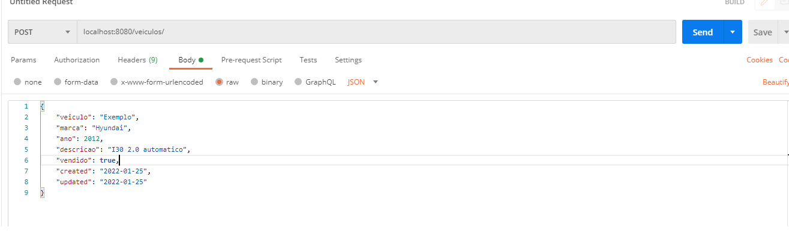
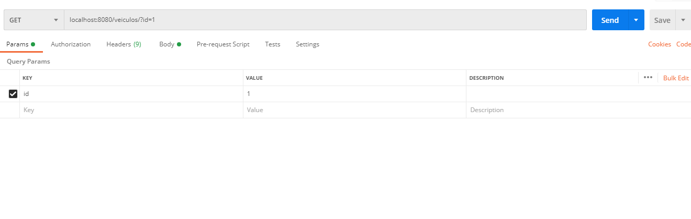

<h1 align="center">    
    <br/>apis-spring-boot
</h1>
<p align="center">Desafio / Teste técnico <strong>Back-end</strong>.</p>

<p align="center">
  <a aria-label="Versão do Java" href="https://www.oracle.com/java/technologies/downloads/">
    </img>
  </a>
  <a aria-label="Versão do Maven" href="https://maven.apache.org/download.cgi">
    </img>
  </a>
  <a aria-label="Versão do MySql" href="https://dev.mysql.com/downloads/">
    </img>
  </a>
  <a aria-label="Versão do Postman" href="https://www.postman.com/downloads/">
    </img>
  </a>
   <a aria-label="Lombok" href="https://spring.io/projects/spring-boot">
    </img>
  </a>
</p>

## O projeto utiliza Spring-boot.

## Swagger
A ferramenta Swagger foi utilizada para a documentação com layout amigável e para testes/uso da API 
através do caminho `localhost:8080/swagger-ui/`.

**É possível testar a API através desta ferramenta substituindo a necessidade do Postman ou software equivalente.**

## 🚀 Instalação
A porta padrão é **8080**. Ao iniciar seu projeto localmente, acesse `localhost:8080`.  
Clone o projeto em seu computador e em seguida configure um servidor local no MySql, coloque a **string de conexão** no arquivo `src/main/resources/application.properties` na propriedade `spring.datasource.url` no modelo **jdbc:mysql://localhost:<ServerPortBD>/<DatabaseName>?allowPublicKeyRetrieval=true&useSSL=false**, e
as substitua as informações de username e password pelas credenciais definidas na sua instalação local do MySql.
  
É necessário também o download das ferramentas Maven e Postman referenciadas no cabeçalho deste documento.

Dependendo da IDE utilizada para executar poderá ser necessário o download e instalação do Lombok:
- Exemplo IDEs que precisa instalar: Eclipse, STS, Red Hat Jboss Developer Studio.
- Exemplo IDE que não precisa instalar: IntelliJ.
  
Executar o arquivo Schema.sql presente nesse repositório para correta criação da tabela de banco de dados e para fazer uma população inicial com finalidade de gerar dados para os testes unitários.

Para compilar e executar alguma das APIs (utilizarei como exemplo o teste técnico número 5):

  Execute o projeto na IDE de sua preferência referenciando como classe principal a seguinte: `src/main/java/com/teste/tecnico5/teste5/Teste5Application.java`
  
## Endpoints
  `/veiculos` : Usado para cadastrar um novo veículo enviado via `body` da requisição tipo POST no formato de JSON com os seguintes parâmetros:
  ``` bash
   {
	    "veiculo": "Bruno3",
		"marca": "Hyundai4",
		"ano": 2012,
		"descricao": "I30 Bruno 2.0 automatico",
		"vendido": true,
		"created": "2022-01-25",
		"updated": "2022-01-25"
   }
  ```
   
  ## 💻 Preview
  <h1 align="center">
      </img>
  </h1>
  <h1 align="center">
      </img>
  </h1>
  
  <hr/>
  
  `/veiculos/{id}`  : Usado para realizar uma consulta dos detalhes de um veículo pelo seu id, necessita do parâmetro enviado via `QueryParam` na requisição tipo GET como mostrado no exemplo abaixo:
  
  ## 💻 Preview
  <h1 align="center">
      </img>
  </h1>
  
  Sendo o parâmetro:
  - `id` : Id do veículo que deseja consultar os detalhes
  
  É retornado um JSON com as informações de resposta no modelo exemplificado abaixo:
  
   ``` bash
    [
      {
		"id_veiculo": 1,
		"veiculo": "Exemplo",
		"marca": "Hyundai",
		"ano": 2012,
		"descricao": "I30 2.0 automatico",
		"vendido": true,
		"created": "2022-01-25",
		"updated": "2022-01-25"
      }
    ]
  ```
  
  <hr/>
  
## 🏆 Desafios
- [x] Cadastro e cálculo solicitado pelo desafio.
- [x] Uso da ferramenta Swagger (desafio pessoal / documentação de código).
- [x] Uso das ferramentas Spring-boot, Lombok, Maven e JPA (desafio pessoal).

## 📜 Licença

[MIT](./LICENSE) &copy; [Bruno Carvalho](https://www.linkedin.com/in/bruno-carvalho2002/)
© 2022 GitHub, Inc.
Terms
Privacy
Security
Status
Docs
Contact GitHub
Pricing
API
Training
Blog
About
